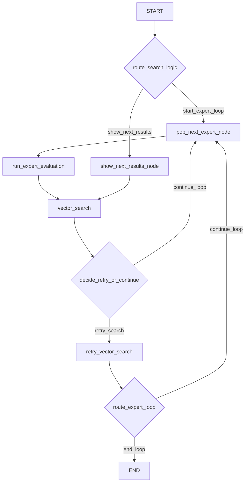

# LangGraph: `search_subgraph` 

이 문서는 `search_subgraph_builder.py`에 정의된 `search_subgraph`의 구조, 구성 요소, 그리고 전체 동작 과정을 설명합니다. 이 서브그래프는 사용자의 의류 검색 요청을 여러 전문가(Expert)의 관점에서 분석하고, 그 결과를 종합하여 벡터 검색을 수행하는 핵심적인 역할을 담당합니다.

## 1. 그래프의 핵심 구성 요소

그래프는 `State`, `Node`, `Router` 세 가지 주요 구성 요소로 이루어집니다.

### 1.1. State (`state.py`)

`State`는 그래프의 모든 노드 간에 공유되는 데이터의 집합으로, 일종의 메모리 역할을 합니다. `TypedDict`로 정의되어 있으며, `search_subgraph`에서는 주로 다음 상태들을 사용합니다.

-   `user_message`: 사용자가 입력한 원본 메시지.
-   `last_updated_fields`: 사용자의 피드백으로 인해 변경된 검색 조건 필드 리스트. (예: `['color_expert', 'style_analyst', 'fitting_coordinater']`)
-   `experts_to_run`: 실행해야 할 전문가의 목록. (예: `['color_expert', 'style_analyst', 'fitting_coordinater']`)
-   `current_expert`: 현재 실행 중인 전문가의 이름.
-   `expert_opinions`: `current_expert`가 생성한 분석 의견. 이 의견이 벡터 검색의 쿼리로 사용됩니다.
-   `messages`: 사용자에게 보여줄 최종 메시지(검색 결과 포함)가 담기는 리스트.
-   `search_result_offset`: "다른거 보여줘"와 같은 요청 시, 다음 검색 결과를 가져오기 위한 오프셋 값.

### 1.2. Nodes (`node.py`)

`Node`는 그래프에서 실제 작업을 수행하는 함수입니다. 각 노드는 `State`를 입력받아 특정 작업을 처리하고, 변경된 `State`를 반환합니다.

-   `pop_next_expert_node`:
    -   `experts_to_run` 리스트에서 다음으로 실행할 전문가를 하나 꺼내(`pop`) `current_expert` 상태를 업데이트합니다.
-   `run_expert_evaluation` (`external_llm_node`):
    -   `current_expert`와 `user_message`를 기반으로 외부 LLM API를 호출합니다.
    -   LLM은 전문가의 관점에서 사용자 요청을 분석하고, 그 결과를 `expert_opinions` 상태에 저장합니다.
-   `vector_search` (`search_node`):
    -   `expert_opinions`를 쿼리로 사용하여 벡터 데이터베이스에서 유사한 상품을 검색합니다.
    -   검색된 상품 ID와 전문가 의견을 `messages` 상태에 추가하여 사용자에게 보여줄 결과를 생성합니다.
-   `show_next_results_node`:
    -   "다른거 보여줘"와 같은 요청을 처리합니다.
    -   `search_result_offset` 상태를 증가시켜 다음 페이지의 검색 결과를 가져올 수 있도록 준비합니다.

### 1.3. Routers (`router.py`)

`Router`는 조건부 엣지(Conditional Edge)로, 특정 노드의 실행이 끝난 후 `State`를 보고 다음에 어떤 노드로 가야 할지 동적으로 결정하는 역할을 합니다.

-   `route_search_logic` (진입 라우터):
    -   그래프의 시작점(`START`)에서 호출됩니다.
    -   `last_updated_fields` 상태를 확인하여 어떤 전문가를 실행할지 결정하고 `experts_to_run` 리스트를 생성합니다.
        -   최초 검색이거나 변경 필드가 없으면 모든 전문가(`['color_expert', 'style_analyst', 'fitting_coordinater']`)를 실행합니다.
        -   색상(`color`)이 변경되면 `color` 전문가만 실행합니다. => `보류` 
    -   만약 "다른거 보여줘" 요청(`next_item` 필드)이 들어오면, 전문가 루프 대신 `show_next_results` 경로로 분기합니다.
-   `route_expert_loop` (루프 제어 라우터):
    -   `vector_search` 노드 실행 후에 호출됩니다.
    -   `experts_to_run` 리스트에 아직 실행할 전문가가 남아있는지 확인합니다.
        -   남아있으면 `continue_loop`를 반환하여 `pop_next_expert_node`로 돌아가 루프를 계속합니다.
        -   더 이상 없으면 `end_loop`를 반환하여 서브그래프의 실행을 종료합니다.

## 2. 전체 동작 과정

아래는 `information_gather_node` , `information_update_node`에 의해 사용자가 원하는 정보가 수집/업데이트 된 이후 `search_subgraph`로 진입했을때의 동작하는 전체 흐름입니다.

1.  **[START] 진입 및 라우팅**:
    -   그래프가 시작되면 `route_search_logic` 라우터가 가장 먼저 실행됩니다.
    -   라우터는 사용자 요청의 성격(최초 검색, 조건 수정, 다음 결과 요청 등)을 판단하여 실행할 전문가 목록(`experts_to_run`)을 결정하고, `start_expert_loop` 경로를 반환합니다.

2.  **[EXPERT_LOOP] 전문가 루프 시작**:
    -   `pop_next_expert_node`: `experts_to_run` 리스트에서 전문가(예: `'color_expert'`)를 하나 꺼내 `current_expert`로 설정합니다.
    -   `run_expert_evaluation`: 설정된 `'color_expert'` 전문가가 외부 LLM을 통해 사용자 요청을 "색상" 관점에서 분석하고, "밝은 파란색 계열의 데님"과 같은 의견을 `expert_opinions`에 저장합니다.
    -   `vector_search`: "밝은 파란색 계열의 데님"이라는 `expert_opinions`를 쿼리로 사용하여 벡터 검색을 수행하고, 결과를 `messages`에 추가합니다.

3.  **[LOOP_CONTROL] 루프 계속 또는 종료**:
    -   `route_expert_loop` 라우터가 실행됩니다.
    -   `experts_to_run` 리스트를 확인하여 아직 다른 전문가(예: `'style_analyst'`, `'fitting_coordinater'`)가 남아있으면 `continue_loop`를 반환합니다.
    -   흐름은 다시 `pop_next_expert_node`로 돌아가 다음 전문가에 대한 2번 과정을 반복합니다.
    -   모든 전문가에 대한 분석과 검색이 끝나 `experts_to_run` 리스트가 비게 되면, 라우터는 `end_loop`를 반환합니다.

4.  **[END] 서브그래프 종료**:
    -   `end_loop`가 반환되면 서브그래프의 실행이 모두 종료되고, `State`의 `messages`에 누적된 모든 전문가의 검색 결과가 최종적으로 사용자에게 표시됩니다.

### ※ 분기 흐름: "다른거 보여줘"

만약 사용자가 "다른거 보여줘"와 같이 다음 결과를 요청하면, `route_search_logic`는 `show_next_results` 경로를 반환합니다. 이 경우 전문가 루프를 실행하지 않고, `show_next_results_node`가 `search_result_offset`을 조정한 뒤 바로 `vector_search`를 호출하여 다음 페이지의 결과를 가져옵니다.

## 3. 그래프 구조 시각화

